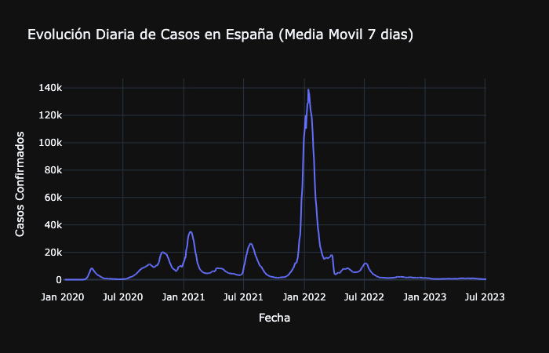
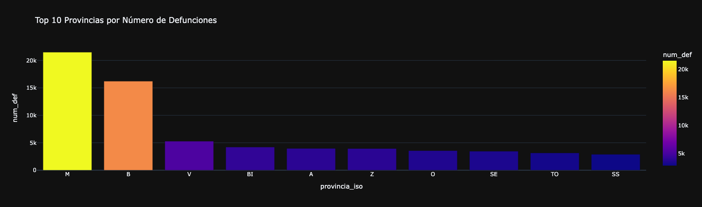
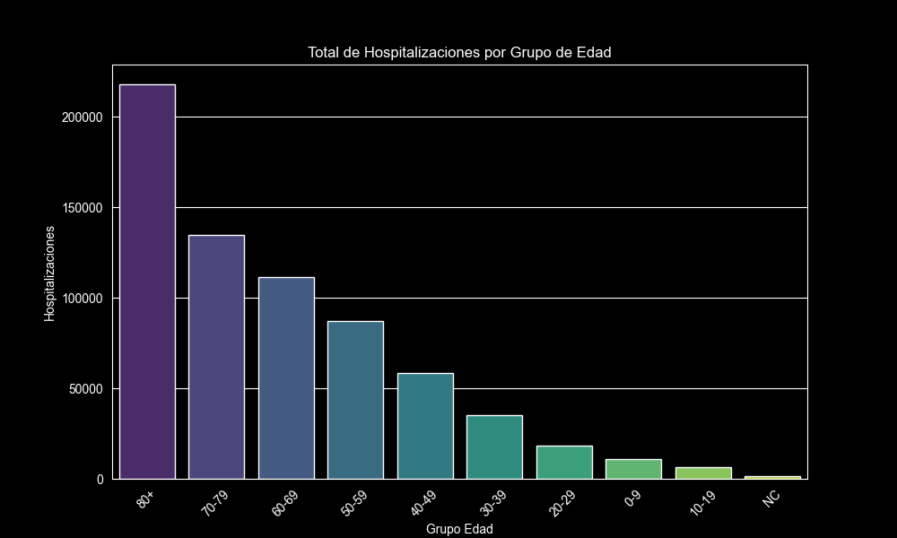
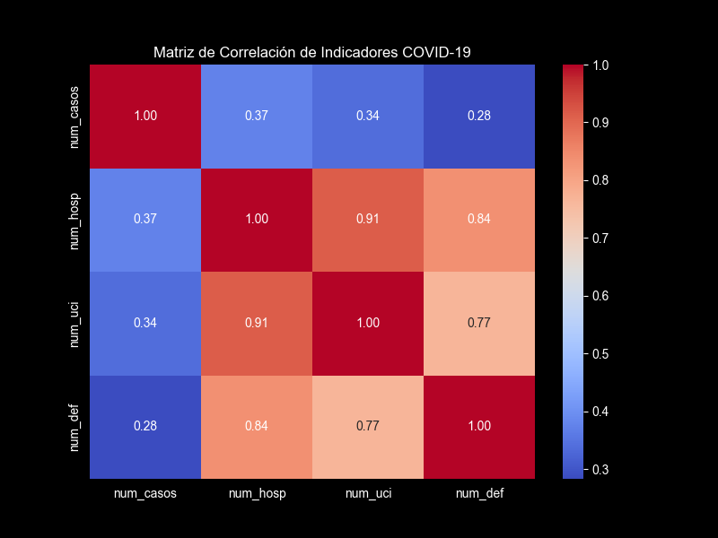
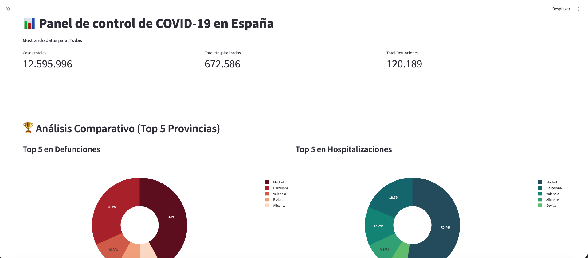
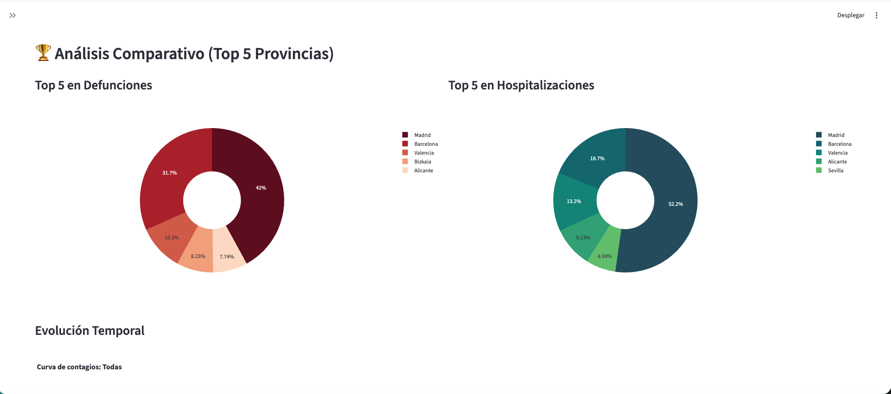

# 📊 COVID-19 Spain Interactive Dashboard


## 📝 Descripción del Proyecto

Este Dashboard interactivo transforma datos crudos de salud pública (procedentes del **Instituto de Salud Carlos III**) en información accionable para la toma de decisiones. La herramienta permite analizar la evolución de la pandemia en España con un desglose detallado por provincias y periodos temporales.

El objetivo técnico fue construir una arquitectura escalable, migrando de identificadores técnicos (códigos ISO) a una interfaz intuitiva mediante técnicas de mapeo de datos y optimización de consultas SQL.

---

## 🚀 Características Principales

- **Filtrado Dinámico:** Selección de provincias y rangos de fechas con actualización reactiva de todos los componentes.
- **Visualización Avanzada:**
  - Gráficos de líneas interactivos para tendencias temporales de contagios.
  - Gráficos de dona (Donut Charts) para el análisis de impacto comparativo (Top 5 en defunciones y hospitalizaciones).
- **Métricas KPI:** Resumen instantáneo de Casos Totales, Hospitalizados y Defunciones basado en los filtros aplicados.
- **Rendimiento Optimizado:** Implementación estratégica de `@st.cache_data` para minimizar la latencia y evitar llamadas redundantes a la base de datos.
- **Arquitectura Limpia:** Separación estricta de lógica de base de datos, constantes de negocio y capa de presentación.

---

## 🔍 Análisis Exploratorio Previo

Antes de construir el dashboard, se realizó un análisis exploratorio exhaustivo para comprender la estructura y distribución de los datos.

### Evolución Diaria de Casos (Media Móvil 7 días)



La serie temporal revela los distintos picos de la pandemia entre 2020 y 2023, con el mayor repunte registrado en enero de 2022, superando los **130.000 casos diarios**.

---

### Top 10 Provincias por Número de Defunciones



Madrid (M) y Barcelona (B) concentran la mayor parte de las defunciones totales, con más de 21.000 y 16.000 respectivamente, reflejando el peso demográfico y la densidad poblacional de ambas provincias.

---

### Hospitalizaciones por Grupo de Edad



El análisis por franja etaria confirma que el grupo de **80+ años** fue el más afectado en hospitalización (~220.000 ingresos), con una tendencia decreciente clara a medida que disminuye la edad.

---

### Matriz de Correlación de Indicadores



La correlación entre hospitalizaciones (`num_hosp`) e ingresos en UCI (`num_uci`) es muy alta (0.91), mientras que el número de casos confirmados muestra una correlación más baja con la severidad clínica, posiblemente por el subregistro en las fases iniciales.

---

## 🛠️ Stack Tecnológico

| Capa | Tecnología |
|---|---|
| Lenguaje | Python 3.10+ |
| Interfaz de Usuario | Streamlit |
| Base de Datos | MySQL 8.0 |
| ORM / Conector | SQLAlchemy & PyMySQL |
| Procesamiento | Pandas |
| Visualización | Plotly Express |

---

## 📂 Estructura del Repositorio

```text
covid_spain_project/
├── app/
│   ├── constants.py           # Diccionario maestro de provincias (ISO -> Nombre real)
│   └── main_app.py            # Punto de entrada y lógica de la interfaz Streamlit
├── data/
│   ├── processed/
│   │   ├── daily_stats_spain.csv  # Serie temporal limpia de casos diarios
│   │   └── master_df.csv          # Dataset maestro consolidado
│   └── raw/                       # Datos originales del ISCIII sin procesar
├── database/
│   └── setup_db.sql           # Script de creación e inicialización de la BD MySQL
├── figures/
│   ├── matrix_covid_indicadores.png
│   ├── newplot.png
│   ├── provincias_mas_defunciones.png
│   └── total_hospitalizaciones.png
├── notebooks/
│   ├── 01_extraction.ipynb    # Extracción y carga de datos crudos
│   ├── 02_cleaning.ipynb      # Limpieza y normalización
│   ├── 03_eda_visual.ipynb    # Análisis exploratorio y visualizaciones
│   ├── 04_db_loading.ipynb    # Carga de datos procesados a MySQL
│   └── 05_eda_final.ipynb     # EDA final sobre la BD
├── src/
│   ├── __init__.py
│   ├── config.py              # Configuración de entorno y conexión
│   ├── database_mgr.py        # Gestión de conexión y pool de SQLAlchemy
│   └── models.py              # Modelos y queries reutilizables
├── .env                       # Variables de entorno (no incluido en el repo)
├── .gitignore
├── requirements.txt           # Listado de dependencias necesarias
└── README.md
```

---

## 🖥️ Vista Previa del Dashboard

### Panel Principal — KPIs y Análisis Comparativo



Vista general con los indicadores clave: **12,5M de casos**, **672K hospitalizados** y **120K defunciones**, junto con los donut charts del Top 5 provincial en defunciones y hospitalizaciones.

### Análisis Comparativo Top 5 Provincias



Madrid concentra el **42% de las defunciones** y el **52.2% de las hospitalizaciones** entre las cinco provincias más afectadas, muy por encima del resto.

---

## ⚙️ Instalación y Configuración

**1. Clonar el repositorio:**
```bash
git clone https://github.com/Powfip/covid-spain-dashboard.git
cd covid-spain-dashboard
```

**2. Entorno Virtual e Instalar Dependencias:**
```bash
python -m venv venv
source venv/bin/activate       # Windows: venv\Scripts\activate
pip install -r requirements.txt
```

**3. Variables de Entorno:**

Renombra el archivo `.env.example` a `.env` y completa tus credenciales:
```env
DB_HOST=localhost
DB_PORT=3306
DB_USER=tu_usuario
DB_PASSWORD=tu_contraseña
DB_NAME=covid_db
```

> La base de datos puede inicializarse ejecutando el script incluido: `database/setup_db.sql`

**4. Ejecutar la aplicación:**
```bash
streamlit run app/main_app.py
```

---

## 📈 Metodología y Transformación de Datos

Para elevar la calidad del análisis, se aplicaron las siguientes transformaciones en el pipeline de datos:

1. **Normalización Lingüística:** Uso de la función `.map()` de Pandas para traducir códigos administrativos (ISO) a nombres geográficos reconocibles por el ciudadano.
2. **Agregación Bajo Demanda:** Lógica condicional que detecta si el usuario requiere una vista provincial o un sumatorio nacional (`groupby` dinámico).
3. **Capa de Caching:** Los datos se mantienen en memoria volátil de Streamlit tras la primera consulta, reduciendo el consumo de recursos del servidor MySQL.

---

## 🤝 Contribución

Las contribuciones son lo que hacen a la comunidad de código abierto un lugar increíble para aprender e inspirar.

1. Haz un Fork del proyecto.
2. Crea tu Feature Branch (`git checkout -b feature/AmazingFeature`).
3. Haz un Commit de tus cambios (`git commit -m 'Add some AmazingFeature'`).
4. Haz un Push a la rama (`git push origin feature/AmazingFeature`).
5. Abre un Pull Request.

---

## 📄 Licencia

Distribuido bajo la Licencia MIT. Consulte `LICENSE` para obtener más información.

---

Desarrollado por **Filipi Henrique** — **[LinkedIn](https://linkedin.com/in/filipi-henrique-garcia-de-oliveira-88b659183/)** | **[Portfolio](https://github.com/Powfip)**
